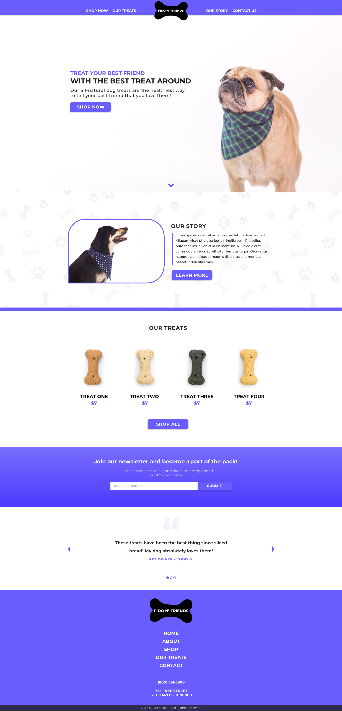

# Code Exercise for Symboliq Interview
This coding exercise will be used to determine what level of comfort you have with web development and if you are able to convert a design mockup into a functioning site. 

**PLEASE READ THROUGH THE DIRECTIONS BEFORE YOU BEGIN**

In order to begin this exercise, download the files to your computer. Within this repository, you will see an Adobe XD file, a jpg of the design, as well as a folder of all images used in the design. You will be expected to create your own HTML document (as well as css file and javascript file where needed) and mimic the design file to your best of abilities. Please note that we are not expecting perfection! Design files are there for direction, but we are aware that with responsive web design that some things may be flexible. Do your best to match the design where you can. 

If there are any difficult sections, please call them out and explain what issues you ran into. **Yes, we're looking for proficiency in your code, but more importantly we want to see how you think through an issue or problem.**

## **The Project**
You will be coding the website for the fictitious Fido N' Friends company. You can see their design below:

## **Requirements**
- You are creating one page of this site. Do not create a page for the "Shop Now," "Our Treats," etc.
- You must deliver a zipped folder with an HTML document as well as all necessary CSS & Javascript documents in order to be graded
- Though only the desktop view is provided, you should also take into consideration that this design must be responsive. Use your creative discretion to determine how that would be work. The header dropdown menu is not required *
- All call-to-action buttons must have a hover state
- The call-to-action buttons as well as the newsletter sign up do not need to be functional nor go to any other page.

### **Bonus Points**
- Add some flair and animation to the page
- Create a completely responsive site (with dropdown menus for the header)
- Make the testimonial slideshow functional. Add three slides with placeholder content.

This project should take a few hours to complete. But please limit yourself to no more than 4 hours. If there are challenging pieces, skip them to come back to them later. We get that life happens! So anything that isn't complete, please just inform us of what challenges you faced and how you think you might've tackled them. Again, this exercise is for us to see your thinking and your experience. 

Once you are finished, please email the zipped folder back to whom you have been in email contact. We appreciate you taking the interest to do this web design coding exercise!

## **IMAGE CREDITS & DISCLAIMER**
Images of the four dog treats as well as the dog treat pattern may not be used for **anything** other than this coding exercise. You are not permitted to use them for any other purposes, and by visiting this repository you agree and understand this condition. 

All images appearing in this respository, unless noted otherwise, have been made available by the author or by another source. I.E. [Matthew Henry](https://burst.shopify.com/@matthew_henry?utm_campaign=photo_credit&amp;utm_content=Picture+of+Small+Dog+-+Free+Stock+Photo&amp;utm_medium=referral&amp;utm_source=credit). I do not claim ownership for images used in this project and all users who utilize the images in the project in any way other than for the personal project claim responsibility for the use. 

